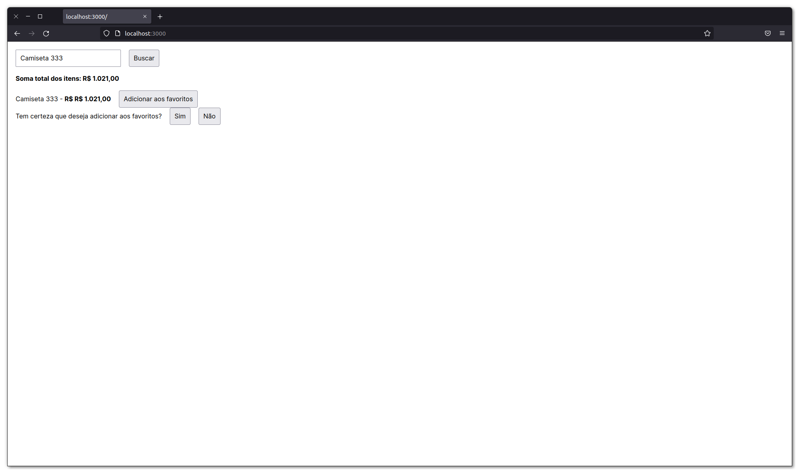

<div id="top" align="center">
  <div>
    
  </div>
  <h4 align="center">React hooks para melhoria de perfomance na aplicação.</h4>
</div>


## Resumo

<ol>
  <li><a href="#visão-geral-do-projeto">Visão geral do projeto</a></li>
  <li><a href="#tecnologias-utilizadas">Tecnologias utilizadas</a></li>
  <li><a href="#instalação-e-utilização">Instalação e utilização</a></li>
  <li><a href="#renderização-no-react">Renderização no React</a></li>
  <li><a href="#memo">memo</a></li>
  <li><a href="#usememo">useMemo</a></li>
  <li><a href="#usecallback">useCallback</a></li>
  <li><a href="#code-splitting-ou-dynamic-import">Code Splitting ou Dynamic Import</a></li>
  <li><a href="#bundle-analyzer">Bundle analyzer</a></li>
</ol>

## Visão geral do projeto

<div align="center">
    
</div>


## Tecnologias utilizadas

* [Next.JS](https://nextjs.org/)
* [React Virtualized](https://github.com/bvaughn/react-virtualized)
* [Sass CSS](https://sass-lang.com/)

## Instalação e utilização

### Pré-requisitos

Instalações necessárias

1. NodeJS
2. Yarn
3. Json Server

### Instalação

1. Baixe as depedências do projeto com o comando `$ yarn`.
2. Rode a Api fake com o comando `$ yarn server`. -> localhost:3333
2. Rode o projeto com o comando `$ yarn dev`. -> localhost:3000

## Renderização no React

Quando e como as renderizações do React acontecem:

1. Quando o componente pai sofre uma alteração, o componente filho também é renderizado.
2. Quando uma propriedade de um componente é alterada.
3. Quando o estado de um hook é alterado (useState, useEffect...).

Fluxo de renderização de um componente:

1. No primeiro instante, é gerada uma nova versão do componente que precisa ser renderizado
de forma virtual.
2. Logo após, uma comparação entre a página virtual e a página já exibida na tela é feita.
Nesse ponto, o algoritimo de reconciliação do React entra em ação, realizando um diffin das
informações, para que seja alterado somente o que é necessário na página. O React nunca apaga
e recria todas as informações, apenas altera.
3. Se houveram alterações, acontece a renderização da nova versão. 

## memo

1. Muito utilizado quando o conteúdo do componente pai muda, mas o do filho permanece o mesmo.
2. Evita que uma nova versão (virtual DOM) do componente seja criada de forma desnecessária, isso acontece
graças ao algoritmo de **Shallow Compare**, que compara tipos primitivos para ver se houve uma
mudança nas propriedades do componente.
3. O segundo parâmentro do memo é utilizado quando as propriedades do componente não são do tipo 
primitivo, ou seja, no caso de arrays e objetos a comparação não funciona da forma correta.
4. Em quais momentos utilizar?
  * Quando temos um Pure Functional Component. São componentes que não envolvem nenhuma lógica,
  apenas recebem (ou não) propriedades e retornam as mesmas, sem nenhuma alteração.
  * Componentes que renderizam demais (Renders too often).
  * Renderizações com as mesmas propriedades.
  * Componentes que tem um tamanho grande ou médio, componentes pequenos não necessitam da 
  utilização do memo.

## useMemo

1. Utilizado para memorizar valores de cálculos muito complexos, e que consumam muito 
processamento da máquina.
2. Também é utilizado para evitar que os valores ocupem novos espaços na memória, exemplo a seguir:

```js
  const totalPrice = useMemo(() => {
    return results.reduce((acc, currentItem) => {
      return acc + currentItem.price
    }, 0)
  }, [results])

  return (
    <>
      /* Sem o useMemo, a cada vez que o NewComponent é criado, o totalPrice ocupa um novo espaço na memória. */
      /* Com o useMemo, a igualdade referêncial é criada. */
      <NewComponent totalPrice={totalPrice}/>
      <NewComponent totalPrice={totalPrice}/>
      <NewComponent totalPrice={totalPrice}/>
    </>
  )
```

## useCallback

1. Utilizado para memorizar funções, que são repassadas como propriedades para outros componentes.

* No presente caso, cada vez que o componente **Home** é renderizado, uma nova versão da função **addToWishList**
é criada na memória. Quando o React for comparar a função dos componentes filhos com a função do componente
**Home**, não haverá igualdade referêcial, sendo assim, a função será recriada nos componentes filhos novamente.

## Code Splitting ou Dynamic Import

1. **Code Splitting** ou **Dynamic Import**, é utilizado para fazer o carregamento preguiçoso de componentes
ou funções que são provindas de importações. Essa prática é muito utilizada quando funcionalidades não
precisam ser carregas na primeira chamada da aplicação, e sim somente quando o usuário fazer uso da mesma.

* Dynamic import de Componente

```js
import { AddToWishListProps } from './AddToWishList' /* interface */

const AddToWishList = dynamic<AddToWishListProps>(
  () => {
    return import('./AddToWishList').then(mod => mod.AddToWishList)
  },
  {
    loading: () => <span>carregando...</span>
  }
)
 ```

 * Dynamic import de Função

```js
  async function showFormattedDate() {
    const datefns = await import('date-fns')
  }
 ```

<br />

<h4 align="center"><a href="#top">Voltar ao Início</a></h4>